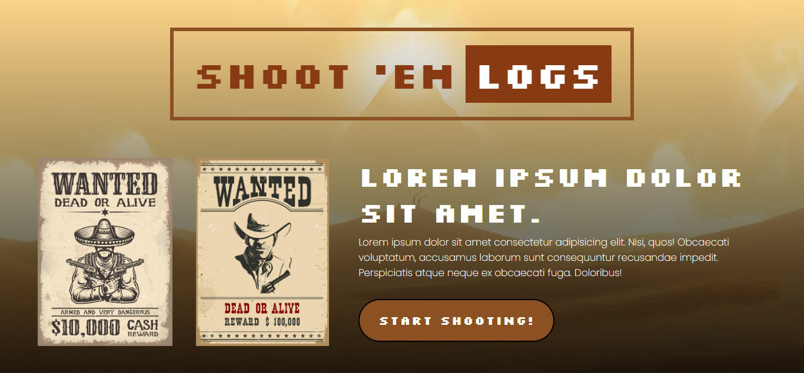

# Shoot 'em Logs!



## Gameplay


## 💡 Inspiration 💡

Howdy neigh-bor! When we were brainstorming for the hackathon theme, we got the idea to emulate the comfy vibes we’d get from retro video games such as Jackal and Contra 🤠🎮

## ⚙ What it does ⚙

It’s a retro-inspired video game where our character, a cowboy, is in the ~wild west~ helping to protect the peace of the land from enemies with a classic point-and-shoot game.

## 🏗 How we built it 🏗

We built it using Unity’s game engine and C#. We deployed the Unity program using WebGL and used the build files in ReactJS that helped us bring it to the web.

## Installation

1. Clone the repository.

```
git clone https://github.com/chalory/Yeehaw-Hacks.git
```

2. Install the dependencies

```
npm install
```

3. Run the server. Do note that the server runs on port 5173.

```
npm start
```

## Contributors

[Chantal Pino](https://github.com/chalory)  
[Christian Mina](https://github.com/sinsimi12)  
[Joshua Sintos](https://github.com/JSintos)  
[Lib Martinito](https://github.com/libmartinito)  
[Renz Vital](https://github.com/rvitality)
